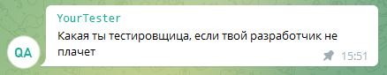

### Привет! 👋

Ресурсный руководитель отдела с девизом:
 

🌱 Прошла курс по автоматизированному тестированию в <a target="_blank" href="https://qa.guru/">qa.guru</a>

## Мой дипломный проект

### UI тесты
<h3> <a target="_blank" href="https://github.com/NadezhdaVarlamova/qa_guru_diplom_ui">Github</a>
 
 <a target="_blank" href="https://jenkins.autotests.cloud/job/VarlamovaNadezhda_qa_guru_10_diplom_ui/">Jenkins</a>
 
<a target="_blank" href="https://allure.autotests.cloud/project/1229/dashboards/">Allure_TO</a></h3>

### API тесты
<h3> <a target="_blank" href="https://github.com/NadezhdaVarlamova/qa_guru_diplom_api">Github</a>
 
 <a target="_blank" href="https://jenkins.autotests.cloud/job/VarlamovaNadezhda_qa_guru_10_diplom_api/">Jenkins</a>
 
<a target="_blank" href="https://allure.autotests.cloud/project/1229/dashboards/">Allure_TO</a></h3>

### Mobile тесты
<h3> <a target="_blank" href="https://github.com/NadezhdaVarlamova/qa_guru_diplom_mobile">Github</a>
 
 <a target="_blank" href="https://jenkins.autotests.cloud/job/VarlamovaNadezhda_qa_guru_10_diplom_mobile/">Jenkins</a>
 
<a target="_blank" href="https://allure.autotests.cloud/project/1229/dashboards/">Allure_TO</a></h3>

<!--
**NadezhdaVarlamova/NadezhdaVarlamova** is a ✨ _special_ ✨ repository because its `README.md` (this file) appears on your GitHub profile.

Here are some ideas to get you started:

- 🔭 I’m currently working on ...
- 🌱 I’m currently learning ...
- 👯 I’m looking to collaborate on ...
- 🤔 I’m looking for help with ...
- 💬 Ask me about ...
- 📫 How to reach me: ...
- 😄 Pronouns: ...
- ⚡ Fun fact: ...
-->
